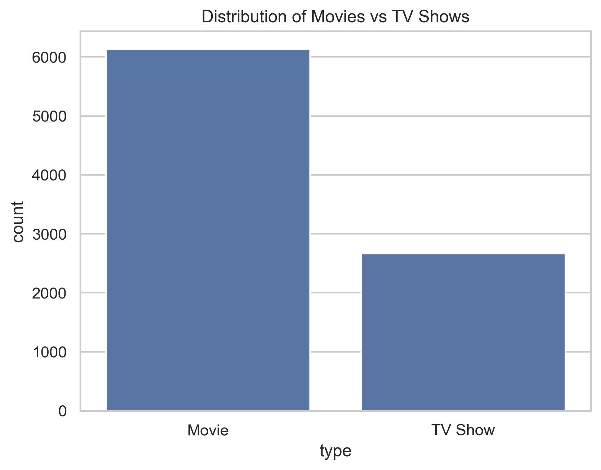
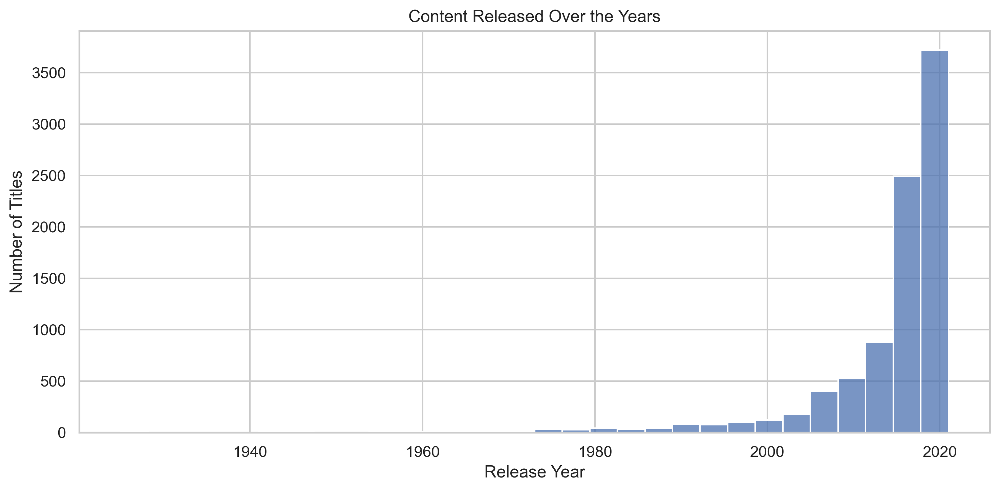
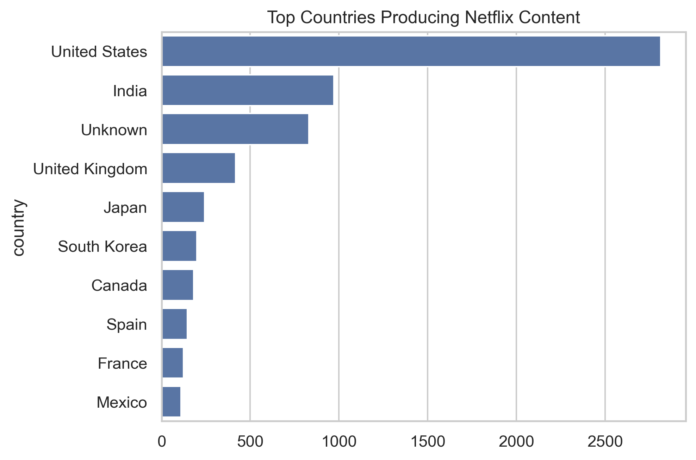

# Netflix Exploratory Data Analysis

## Objective

Explore Netflix content patterns including distribution, ratings, countries, and genres.

## Dataset

Netflix Movies and TV Shows Dataset

## Tools Used

Python
Pandas
Matplotlib
Seaborn

## Key Questions

* Movies vs TV Shows distribution
* Content release trends
* Top producing countries
* Most common genres
* Content ratings distribution

## Key Insights

* Movies dominate Netflix content
* Content production increased rapidly after 2015
* USA produces the most titles
* Most movies are 80–120 minutes long

## Key Visualizations

### Movies vs TV Shows Distribution


### Content Release Trend


### Top Producing Countries


## Project Structure
```
netflix-eda-project
│
├── data
│   └── netflix_cleaned.csv
│
├── notebook
│   └── netflix_eda.ipynb
│
├── images
│   ├── movies_vs_tvshows.png
│   ├── movie_duration_distribution.png
│   ├── rating_distribution.png
│   ├── release_year_trend.png
│   ├── top_10_countries.png
│   └── top_genres.png
│
└── README.md
```


